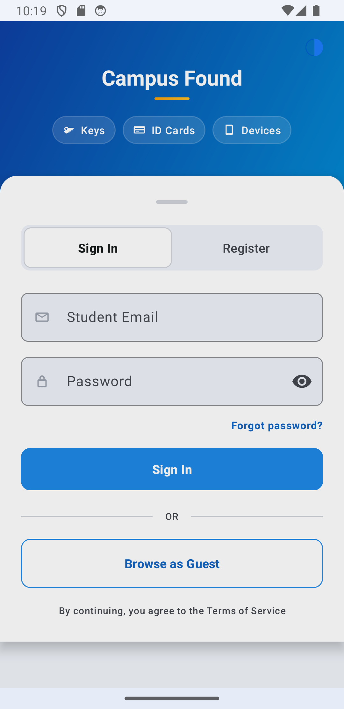
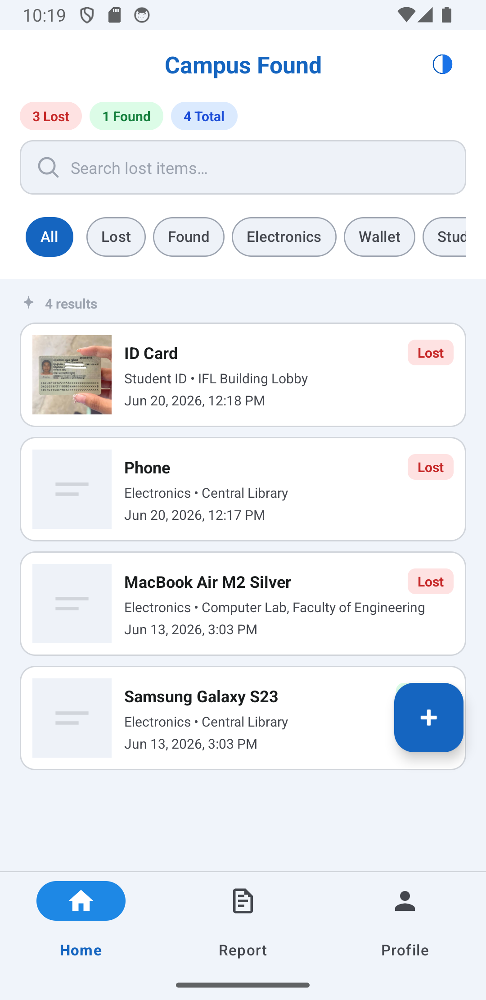
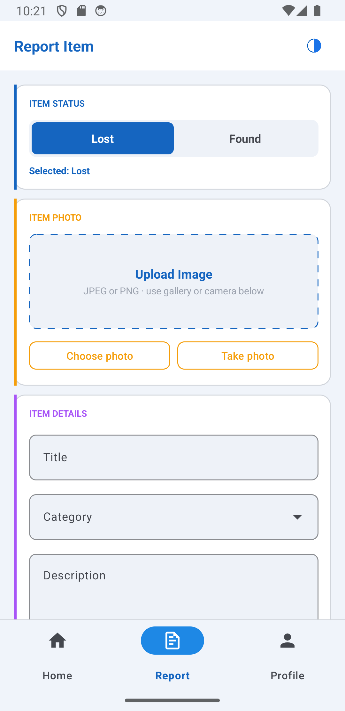
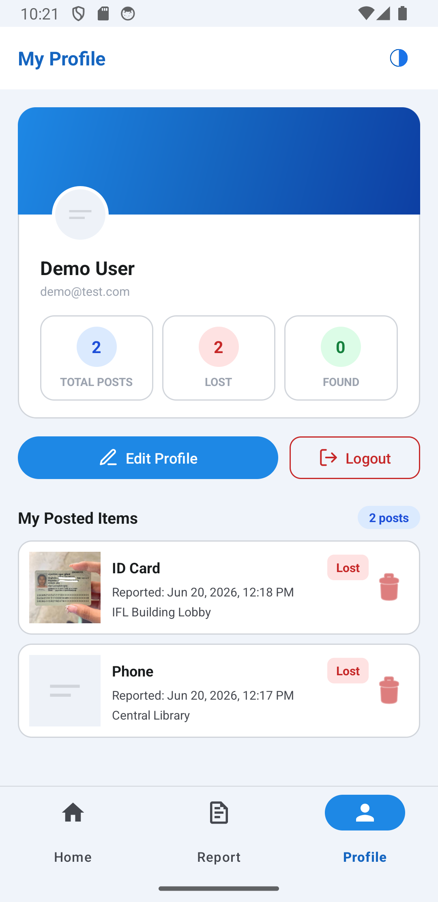

# Campus Found

Campus Found is an Android lost-and-found app for campus use. Students can browse items as guests, search and filter listings, and sign in to report lost or found items and manage their profile.

This is a **student portfolio / demo release**. It does not include an admin dashboard or staff moderation tools.

## Screenshots

| Login | Home | Report | Profile |
| --- | --- | --- | --- |
|  |  |  |  |

## Features

| Area | What students can do |
| --- | --- |
| Guest mode | Browse Home, search, filter, and view item details without logging in |
| Account | Register, login with email or phone, reset password, edit profile, logout |
| Home | Browse items, search, filter by status or category, pull to refresh |
| Report | Post a lost or found item with optional photo, free-text location, and contact info |
| Detail | View item photo, status, location, reporter, and contact action |
| Profile | View stats, manage own posts, delete own posts, sync edits to MockAPI |
| App | Light/dark mode, Room cache fallback when network fails |

## Tech Stack

| Layer | Tools |
| --- | --- |
| Language | Kotlin |
| UI | Material 3, View Binding, Navigation Component |
| Architecture | MVVM, Repository pattern, Hilt (DI) |
| Networking | Retrofit, Gson, MockAPI |
| Local storage | Room (offline item cache) |
| Async | Coroutines, StateFlow |
| Images | Glide; Firebase Storage optional, base64 fallback for demo |
| Testing | Espresso instrumented tests, Room instrumentation tests |

## Architecture

```
UI (Activities / Fragments)
        ↓
ViewModels (StateFlow)
        ↓
Repositories (ItemRepository, UserRepository)
        ↓
Retrofit (MockAPI)  +  Room (cached_items)
```

- **Guest users** can browse Home; Report and Profile require login (`MainActivity` navigation guard).
- **Offline fallback:** if the items API fails, the app reads from Room cache when data exists.
- **Auth:** login, register, forgot password, and profile edits sync to MockAPI `/user`.

## Demo Flow

1. Open the app and browse Home as a guest.
2. Search, use filter chips, and open an item detail page.
3. Tap Report or Profile to see the login-required prompt.
4. Register a new account, or sign in with a demo account (below).
5. Use **Forgot password?** on the login screen to reset via MockAPI.
6. Report a lost or found item — enter location as free text (e.g. `A610, Library`).
7. Return to Home, pull to refresh, then open Profile and logout.

## Demo Accounts (MockAPI)

| Email | Password |
| --- | --- |
| `vit@gmail.com` | `12345678` |
| `demo@test.com` | `123456` |
| `demo@gmail.com` | `123456` |

You can also register a new account from the login screen.

## Getting Started

### Requirements

- Android Studio Ladybug or newer
- JDK 11+
- Android SDK 35
- Emulator or device (API 28+)

### Run locally

```bash
git clone https://github.com/bundavit/Campus-Found-Mobile.git
cd Campus-Found-Mobile
# Copy local.properties.example → local.properties and set sdk.dir
./gradlew assembleDebug
./gradlew installDebug
```

### Tests

```bash
./gradlew testDebugUnitTest
./gradlew connectedDebugAndroidTest   # requires emulator/device
```

## Backend

- **MockAPI base URL:** `https://6a1460d76c7db8aac05469d9.mockapi.io/`
- **Users** — `GET/POST/PUT /user` for auth, registration, profile, password reset
- **Items** — `GET/POST/PUT/DELETE /items` for lost and found posts
- **Photos** — Firebase Storage when `app/google-services.json` is present; otherwise base64 fallback (see `google-services.json.example`)

## Project Info

| | |
| --- | --- |
| Application ID | `com.lostfound` |
| Namespace | `com.example.lostfound` |
| Version | `1.1` (code `2`) |
| Min SDK | 28 |
| Target / Compile SDK | 35 |

## Known Limitations (Demo)

This app is intentionally scoped for a student demo. A production release would differ:

- Passwords are stored in **plain text** on MockAPI and in **SharedPreferences** for profile sync — use token-based auth and EncryptedSharedPreferences in production.
- No admin moderation, push notifications, or email verification.
- Khmer (`values-km`) localization is partial; English is used as fallback for untranslated strings.
- Release builds do not enable R8 minification in this demo configuration.

## License

Student academic / portfolio project. Add a license here if you open-source it publicly.
